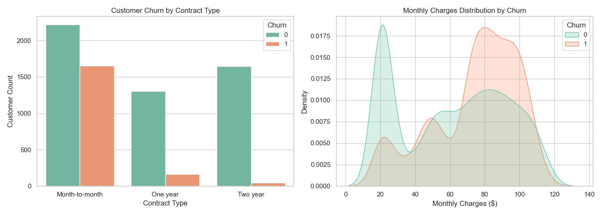

# Telco Customer Churn Analytics & ML Pipeline


An end-to-end data science project uncovering customer attrition drivers and predicting telecom churn using SQL exploratory analysis and a Random Forest classification model.

---

## Key Results
* **Machine Learning Performance:** Achieved **79% accuracy** and an **82.5% ROC-AUC** score.
* **SQL Key Drivers:** Identified Month-to-month contracts (**42.7% churn rate**) and higher monthly charges as the primary drivers of customer attrition.

---

## Visual Dashboard


---

## Project Architecture

```text
customer-churn-analytics/
├── .gitignore
├── LICENSE
├── README.md
├── WA_Fn-UseC_-Telco-Customer-Churn.csv  # Raw dataset
├── analysis.py                           # Ingestion & data cleaning
├── churn_analysis.sql                    # SQL analytics queries
├── churn_analysis_plots.png              # Generated dashboard
├── churn_model.py                        # Scikit-learn ML pipeline
├── run_sql.py                            # SQLite database connector
└── visualise.py                          # Seaborn visualization script
